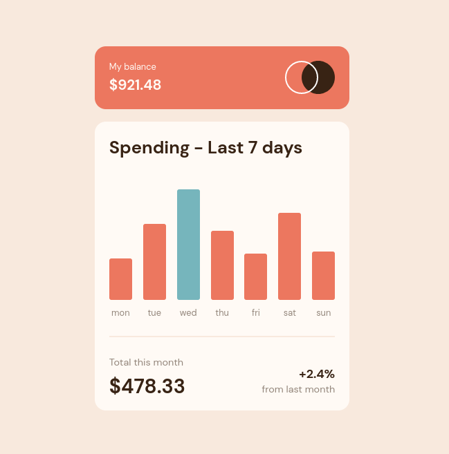

# Frontend Mentor - Expenses chart component solution

This is a solution to the [Expenses chart component challenge on Frontend Mentor](https://www.frontendmentor.io/challenges/expenses-chart-component-e7yJBUdjwt). Frontend Mentor challenges help you improve your coding skills by building realistic projects.

## Table of contents

- [Overview](#overview)
  - [The challenge](#the-challenge)
  - [Screenshot](#screenshot)
  - [Links](#links)
- [My process](#my-process)
  - [Built with](#built-with)
  - [What I learned](#what-i-learned)
  - [Continued development](#continued-development)
  - [Useful resources](#useful-resources)
- [Author](#author)
- [Acknowledgments](#acknowledgments)

**Note: Delete this note and update the table of contents based on what sections you keep.**

## Overview

### The challenge

Users should be able to:

- View the bar chart and hover over the individual bars to see the correct amounts for each day
- See the current day’s bar highlighted in a different colour to the other bars
- View the optimal layout for the content depending on their device’s screen size
- See hover states for all interactive elements on the page

### Screenshot

### Links

- Live Site URL: [Live project at Cloudflare Pages]()

## My process

### Built with

- Semantic HTML5 markup
- CSS custom properties
- Flexbox

### What I learned

AI got the opportunite to review my knowledge on flexbox and ::pseudo-elements as well as those HTML tags that I always forget. Still really trick to know how to structure the HTML, but I'm always learning :)

### Continued development

- I definitly need more HTML practice focus on code structure and proper tags usage
- There are some CSS properties like :nth-child that I have to put a little more effort
- Start my studies at dark modes / prefer-color-scheme

## Author

- Website - [I really need to work on it]()
- Frontend Mentor - [@rwxganta](https://www.frontendmentor.io/profile/rwxganta)
- Twitter - [@rwxganta](https://www.twitter.com/rwxganta)
